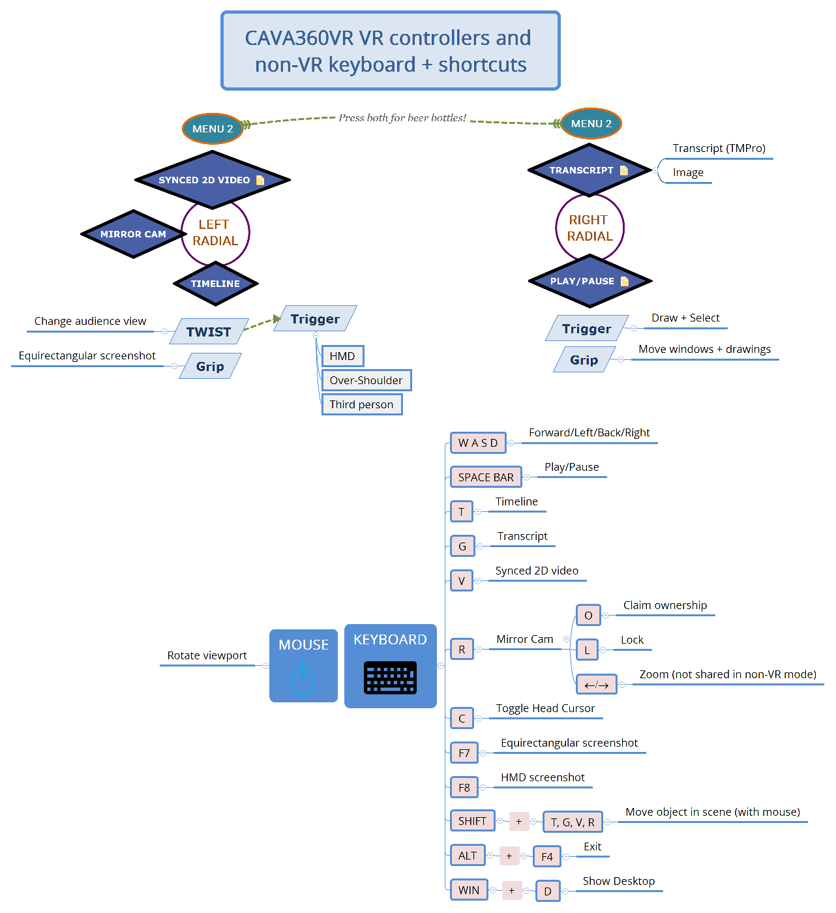

This is a help guide for setting up and using our beta prototype version of multi-user CAVA360VR (_Collaborate, Annotate, Visualise, Analyse 360 video in VR_).

## Requirements

Anyone who wishes to take part in a CAVA360VR session needs to install a version of the software on their laptop/PC with Windows 10 only. An internet connection is required.
- If a user wishes to use it in VR mode, then they will need a VR headset installed with SteamVR. Most headsets work that have to be connected to a computer, eg. HTC VIVE PRO, HP REVERB, OCULUS RIFT, HTC COSMOS, VALVE INDEX have been tested.
- If a user wishes to use it in non-VR mode (desktop), then it should work on any decent laptop or PC that can play 4K video.
- Make sure that your audio speakers and microphone are working on your computer or your VR headset.
It is best to always use headphones to avoid feedback looping.

## How to download and setup CAVA360VR

1. It is quite easy to download a release as a ZIP file, unzip it on your computer and run it on WINDOWS 10.
Look for the latest version on the [RELEASES](https://github.com/BigSoftVideo/CAVA360VR-beta-testing/releases) page in this repository on GitHub.
Or download the latest version from the link you were provided with.
1. Unzip the file you downloaded and copy the folder to the location you prefer, for example in `C:/Program Files` on Windows 10.
1. There is no program to install.
Just double click on the `CAVA360VR.exe` file to run CAVA360VR.
The file is found in the unzipped folder which comprises the following files and folders:

```
CAVA360VR_Data
MonoBleedingEdge
CAVA360VR.exe
UnityCrashHandler64.exe
UnityPlayer.dll
```

## How to use CAVA360VR

Every time you run CAVA360VR you will need to connect to a remote server to access the CAVA room that you or another user has designated.
Everyone has to connect to the same room, so type the exact name into the box.
Also, add your username for the session.
If the room name is correct, then you will see other users and their avatars in the room if they are already present.

NOTE: The basic version of CAVA360VR comes with the Lego Demo Project, which has two videos and a transcript included under a Creative Commons CC BY-NC-SA 4.0 International license.
The video data for this project is about 160MB.
When you run the software and enter the designated room, then you will see the 360 video automatically.
The 2D video clip and the transcript are only visible if the user performs the command to do so (see below).

## Commands and shortcuts for VR and non-VR

This diagram lists all the commands and shortcuts that are possible for both modes.



The top section shows the VR controller button actions.
Sometimes you have to play around with the controller for the VR setup to find where the `MENU 2` button or the grip is located.
On some VR controllers the touchpad is replaced by a joystick; experiment to find out how to view and select from the options on the radial menus.
The bottom section shows the keyboard commands and shortcuts to do the equivalent action in non-VR mode.
Non-VR mode users can do everything that VR mode users can do, except use the drawing tools to mark up the video.

## Setting up CAVA360VR with your own data

To setup CAVA360VR to use your data, then there are some steps involving copying files and editing a plain text file that must be undertaken:

1. Locate and open the folder in which the CAVA360VR program resides.
1. Open the subfolder `CAVA360VR_Data`.
1. In this folder you will find a file called `project.txt`.
Open it in a plain text editor like _Notepad_.
1. Open the subfolder `_COPIED_TO_BUILD_`.
1. In this folder you will find some files that are listed in the `project.txt` file you already opened.
For example, the file may contain the following three lines:

```
_COPIED_TO_BUILD_\Insta360 short G1 audio.mp4
_COPIED_TO_BUILD_\G1 GoPro short.mp4
_COPIED_TO_BUILD_\lego-transcript.txt
```

These files listed will be in the `_COPIED_TO_BUILD_` folder.
- The first file is the master 360 video. 
It is an MP4 file.
- The second file is a synced 2D video. 
It is an MP4 file.
See our [online video that can help you edit and render synced videos](https://youtu.be/FWZy9PK_ODw).
- The third file is a transcript as a text file.
It is a TXT file, but it can be an image as well (PNG).

Next steps:
1. You need to delete those three files, replace them with your own in the same folder, and change the filenames in the `project.txt` to match your filenames.
    - A cleaner alternative is to first make a copy of the whole folder in which the CAVA360VR program resides, and rename it with an indication that it is your data, eg. `CAVA360VR My Data`.
Then you can delete the files above in your copy.
The original Lego demo project will still be available in the original folder.
1. Make sure that your video files are not too large, because you will have to share them with everyone else in the session so they need to be downloadable.
1. If you do not have a synced 2D video or a transcript, then just leave the line blank.

Your `project.txt` file will now look something like this:

```
_COPIED_TO_BUILD_\My 360 video.mp4
_COPIED_TO_BUILD_\My 2D video.mp4
_COPIED_TO_BUILD_\My transcript.txt
```

Next steps:
1. Test by opening CAVA360VR to see if the 360 video (and 2D video or transcript) are present and playable. 
1. To share, go up to the folder above the `CAVA360VR.exe` program.
1. Right click on the folder and select `Send to/Compressed (zipped) folder`.
A file will be generated, something like `CAVA360VR...zip`.
    - If you require encryption, then you will have to use free zip archiving software such as _7-zip_ or _WinZip_.
You can add a password and send that password to everyone who needs to unzip the archive.
1. This zip archive can be sent to everyone who needs it.
If they use the wrong CAVA360VR package, however, then they will see a different 360 video and things will get a little crazy.

## NOTES on 360 video clips
- The resolution and bit rate of the 360 video should be as high as possible, otherwise the video playback will be blocky and blurred in VR.
Use the raw footage and render at a high bit rate using the camera software (or _MistikaVR_).
- Stitch the raw footage carefully so that the stitch lines between lenses are not too visible.
- With mobile 360 cameras use stabilisation while filming or stabilise later in the camera software.
_MistikaVR_ has tools for re-stabilising, but it is not free and it takes some effort.

## Notes
- CAVA360VR is a prototype. 
It is not meant for public use.
Please do not share with others unless permission has been given by the developers.
- CAVA360VR uses a multi-user network gaming service with a built-in account that is registered to BigSoftVideo.
This allows 20 simultaneous users for all versions of CAVA360VR.
Therefore, if several groups are using the software at the same time but independently, then the total number of users cannot exceed 20.
- Future development will allow users to create their own account with the network gaming service and run CAVA360VR completely independently.
- Because of these restrictions, please do not use CAVA360VR for non-research purposes.

## Bug reports

How to enter a [bug report issue](https://github.com/BigSoftVideo/CAVA360VR-beta-testing/issues/new/choose).
This link will only work if you have an account on GitHub and are a member of the beta-testing group.

## Feature requests

How to enter a [feature request or enhancement](https://github.com/BigSoftVideo/CAVA360VR-beta-testing/issues/new/choose) to a tool issue.
This link will only work if you have an account on GitHub and are a member of the beta-testing group.

## Project

You will be able to track bugs and features as issues in our [project KANBAN board](https://github.com/BigSoftVideo/CAVA360VR-beta-testing/projects/1).
This link will only work if you have an account on GitHub and are a member of the beta-testing group.

## Using SLACK to communicate directly with the developers

We are using a channel `#cava-beta` on our BigVideo workspace on Slack to share thoughts and fix issues interactively with beta-testers.
Please ask the developers if you would like to join.
