This is a help guide for setting up and using our open-source version of CAVA360VR2 (_Collaborate, Annotate, Visualise, Analyse 360 video in VR_). CAVA2 is multiuser Virtual Reality application built with Unity and Photon Engine. It is also possible to run CAVA2 in desktop mode on windows 10/11 (not mac). CAVA2 is an extension of our software prototype CAVA360VR (never released) and our free tool [AVA360VR](https://bigsoftvideo.github.io/AVA360VR/). Our ambition is to create an open project for collaborative immersive analysis and training. 

Below we outline the requirements, how to set up a new project, 10 features of CAVA2 and how to contribute to the project. 

## Requirements

Anyone who wishes to take part in a CAVA2 session needs to install a version of the software on their laptop/PC with Windows 10 /11. CAVA2 is **not** available on stand-alone headsets. 
An internet connection is required to make the magic happen.
    - A VR headset installed with SteamVR.
    - Most high-end VR headsets work that have to be connected to a computer, eg. HTC VIVE PRO, HP REVERB, OCULUS RIFT, HTC COSMOS, VALVE INDEX have been tested.
    - The Oculus Quest 2 (with link) has been tested.
- Make sure that your audio speakers and microphone are working on your computer or your VR headset.

## How to download and setup CAVA360VR2

It is quite easy to download a release as a ZIP file, unzip it on your computer and run it on WINDOWS 10/11.
The downloaded file is the CAVA2Builder, which you need to create a CAVA2 session. 
So you need to create a build before you can run a CAVA2 session. 

Follow these steps
## Step 1: Prepare your system
- Ensure you have a **VR-ready computer** with internet connectivity.
- Supported HMDs include:
  - Oculus Rift S
  - HTC Cosmos
  - HTC VIVE Pro 1+2
  - HP Reverb G2
- Confirm that built-in microphones are functioning for voice communication.

## Step 2: Obtain the CAVA2 installer
- Acquire the **CAVAbuilder tool** to make your **CAVA360VR2** via this link (link to github repo).

## Step 3: Install and configure CAVA2
1. Launch the **CAVAbuilder tool**.
2. Input and validate your **Photon Voice App ID**:
   - Sign up for Photon Engine services [here](https://www.photonengine.com/).
   - Note: The free version supports up to 20 users.
   - Create your own app server - _select voice_ when creating the server
3. Add synchronised (it is really important that the media files are in sync) media files to your project:
   - 360-degree videos
   - 2D video files
   - Images or 3D objects
   - DOTE transcript files

## Step 4: Build Your Project
- Use **CAVAbuilder** to compile all files and settings into a project folder.
- The folder will include:
  - All the added media files
  - A unique **Photon App ID**
  - An executable file (`.exe`) for launching the CAVA360VR2 project
 

## Step 5: Share, Launch and Connect
1. Share the project folder securely with all participants.
2. Open the `.exe` file on each participant's system.
3. Enter your preferred username when prompted.
4. Begin your collaborative VR session:
   - Use the **file browser**, timeline, and other CAVA2 tools to navigate and collaborate in the VR space.

---

### Notes
- Ensure all media files are synchronized before importing them into the project [Instructions](https://youtu.be/FWZy9PK_ODw).
- Follow GDPR regulations by avoiding the inclusion of sensitive personal data (this is entirely your responsibility)

<!---##DEMO project
On the Github page you can also find a DEMO project. The DEMO project contains a number of video files. So you can just try out the software before building your own project. 
When you run the software and enter the designated room, then you first have to open the file browser to open a 360-degree video. 
The 2D video clip and the transcript are only visible if the user performs open them using the file browser-->

## 11 featured tools of CAVA2

## 1. **File browser**
- Access and open all media files (360-degree videos, 2D media, images) within the VR environment.
- Files can be repositioned and scaled for optimal viewing.

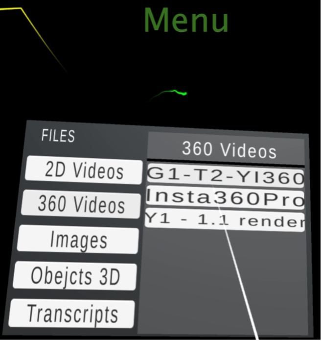

## 2. **Timeline navigation**
- Navigate to specific points in videos using a timeline.
- Playback is synchronized across all participants in real-time.

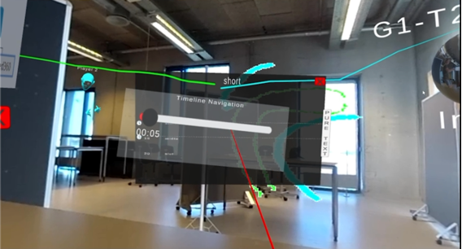

## 3. **Drawing tool**
- Annotate directly on 360-degree videos.
- Features adjustable brush sizes and erasing capabilities.
- Drawings are visible to all participants throughout the video.

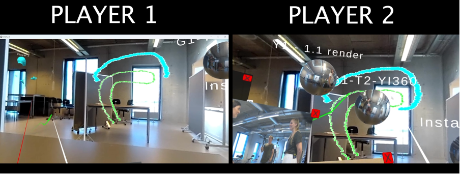

## 4. **Laser pointer with animated trail**
- Visualizes user focus and direction with an animated trail.
- Helps with pointing and guiding others in the shared environment.

## 5. **Teleport option**
- Allows users to move within the VR space by selecting a new location.
- Facilitates dynamic group formations and better spatial interaction.

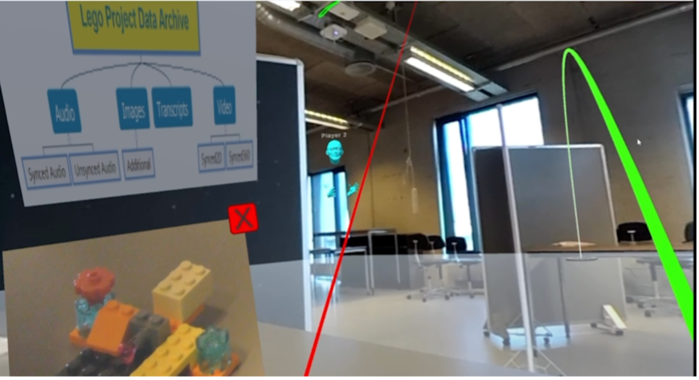

## 6. **Multiple video portals**
- Switch between different 360-degree video perspectives.
- Communication remains synchronized across all portals.

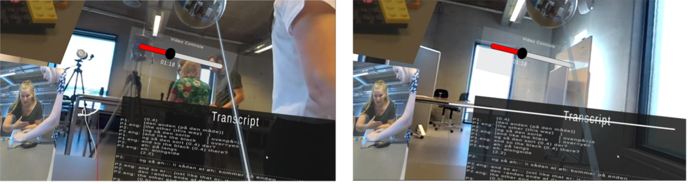

## 7. **Avatar customization**
- Each participant is assigned a unique colour for easy identification.
- Colors appear on avatars, laser pointers, drawings, and portal indicators.

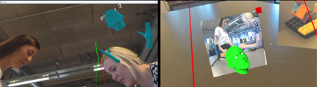

## 8. **Transcript viewer**
- CAVA2 can read and display [DOTE](https://www.dote.aau.dk) transcripts synchronised with the video 
- Displays synchronized transcripts linked to video playback.
- Users can navigate videos using transcript timestamps.

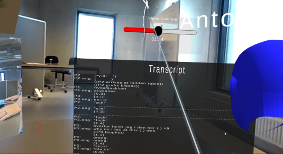

## 9. **Zoom and rotate**
- Media objects, including video portals, can be zoomed and rotated.
- Enhances spatial alignment and collaborative focus.

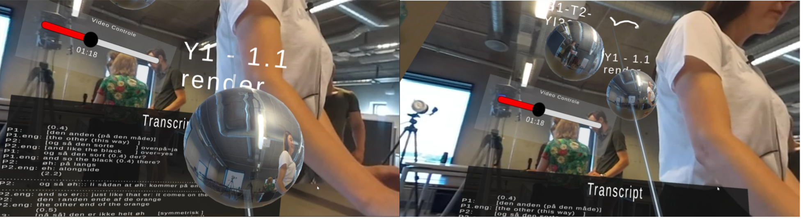

## 10. **Portal colour indicators**
- Colored rings around portals show which participants are inside.
- Dynamic updates reflect user movement between portals.

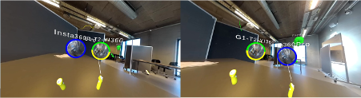

## 11. **Mirror cam**
- Activate the mirror cam to see what is behind you
- Lock the mirror cam and reposition the window in the 360VR space

## Commands and shortcuts for VR mode

These two diagrams list all the commands and shortcuts that are possible in VR.

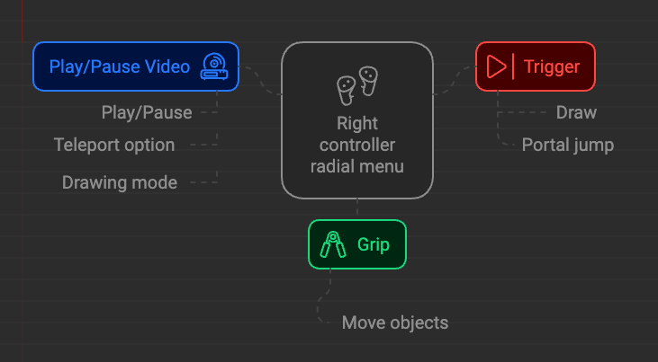

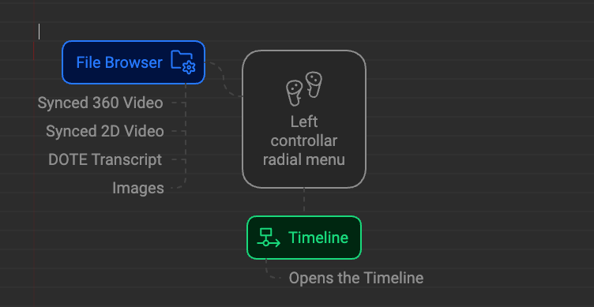

The top section shows the VR controller button actions.
Sometimes you have to play around with the controller for the VR setup to find where the `MENU 2` button or the grip is located.
On some VR controllers the touchpad is replaced by a joystick; experiment to find out how to view and select from the options on the radial menus.

## Commands and shortcuts for desktop mode
The diagram lists all the commands and shortcuts that are possible in desktop mode

## Cooperating in CAVA2 rooms

It is really important to appreciate how CAVA360VR affords a particular democratic model of virtual collaboration.
Basically, all tools are shared by everyone, even though you can reposition them independently.
If a tool is opened, then everyone sees it, eg. timeline, transcript, 2D video window or mirror cam.
Note that where the tool is located in 3D is personal to each avatar.
Anyone in a room can open and close the shared tools, and the action will happen for everyone, eg. if someone closes the open timeline, then it is closed for everyone.
Thus, it supports more democratic participation than the host/guest model.
For example, Zoom has a built-in host/guest model that means the host(s) have more privileges than guests.
Guests cannot do very much in a room, unless given permission by the host(s).
However, the CAVA model can be abused if everyone tries to take control of a tool at the same time!
Thus, collaboration can often be better managed via the share audio chat channel.
<!---Note that the mirror cam supports a host, but anyone can take over the host role at will.-->

<!---NOTE: If a user downloads the wrong CAVA2 package, then they will see a different 360 video and things will get a little crazy.-->

## NOTES on 360 and 2D video clips
- The resolution and bit rate of the 360 video should be as high as possible, otherwise the video playback will be blocky and blurred in VR.
Use the raw footage and render at a high bit rate using the camera software (or _MistikaVR_).
- The dimensions of the 360 video should be 4K or UHD, eg. from 3840x1920 up to 4096x2160.
Do not use 5K or 8K clips.
Many computers will not be able to play such high resolution video, especially not when playing at the same time as an inserted 2D video clip.
- Stitch the raw footage carefully so that the stitch lines between lenses are not too visible.
- With mobile 360 cameras use stabilisation while filming or stabilise later in the camera software.
_MistikaVR_ has tools for re-stabilising, but it is not free and it takes some effort.
- The 2D video clip is best at HD resolution, not 4K.

## Notes
- At present, CAVA2 is a working open-source prototype. 
- CAVA360VR uses a multi-user network gaming service that requires an account.
When setting up a session with your own data, you will need to apply for an account on the Photon platform.
This will allow 20 simultaneous users per session of CAVA2.
If several groups are using the same account at the same time but independently, then the total number of users still cannot exceed 20.
- Because of these restrictions, please do not use CAVA2 for non-research and educational purposes.

## Bug reports

How to enter a [bug report issue](https://github.com/BigSoftVideo/CAVA360VR-beta-testing/issues/new/choose).
This link will only work if you have an account on GitHub and are a member of the beta-testing group.

## Contributing

Please clone or fork the repo and contribute on GitHub.
We welcome pull requests on the `development` branch or branches off development.

## Feature requests

How to enter a [feature request or enhancement](https://github.com/BigSoftVideo/CAVA360VR-beta-testing/issues/new/choose) to a tool issue.
This link will only work if you have an account on GitHub and are a member of the beta-testing group.

## Tracking bugs and feature requests

You will be able to track bugs and features as issues in our [project KANBAN board](https://github.com/BigSoftVideo/CAVA360VR-beta-testing/projects/1).
This link will only work if you have an account on GitHub and are a member of the beta-testing group.

## Using DISCORD to communicate directly with the developers

## History

The _CAVA360VR2_ software package was initially developed as a prototype in 2024 by Anton Larsen (@alarse16) according to the design specifications of Jacob Davidsen (@codeslayer84) and Paul McIlvenny (@skandilocks) in the [BigSoftVideo](https://github.com/bigsoftvideo) team at Aalborg University, Denmark. Lucas Paulsen (@xx) played a crucial role in designing and testing CAVA360VR2.

## How to cite
Davidsen, J., McIlvenny, P., Paulsen, L., & Larsen, A. C. M. (2024). CAVA360VR2.0. Manuscript in preparation. Computer programme

We are using a channel `#beta-cava360vr` on our BigVideo server on Discord to share thoughts and fix issues interactively with beta-testers.
Please ask the developers if you would like to join.

## Research papers related to CAVA360VR2

Davidsen, J., & McIlvenny, P. (2022). Towards Collaborative Immersive Qualitative Analysis. In Weinberger, Armin, W. Chen, D. Hernández-Leo, & B. Chen (Eds.), CSCL2022 conference proceedings. ISLS.

Davidsen, J., Larsen, D. V., Paulsen, L., & Rasmussen, S. (2022). 360VR PBL: A new format of digital cases in clinical medicine. Journal of Problem Based Learning in Higher Education. https://doi.org/10.54337/ojs.jpblhe.v10i1.7097

Davidsen, J., Larsen, D. V., Rasmussen, S., & Paulsen, L. (2024). Collaborative 360° Virtual Reality training of medical students in clinical examinations. Medical Education Online. https://doi.org/10.1080/10872981.2024.2412398

Davidsen, J., McIlvenny, P., & Kovács, A. B. (2022). Volumetric Capture and Replay in Virtual Reality – Entering the age of immersive and volumetric analysis in CSCL. In Weinberger, Armin, W. Chen, D. Hernández-Leo, & B. Chen (Eds.), CSCL2022 conference proceedings. ISLS.

Davidsen, J., McIlvenny, P., & Ryberg, T. (2023). Researching Interactional and Volumetric Scenographies – Immersive Qualitative Digital Research. In P. Jandric, A. MacKenzie, & J. Knox (Eds.), Postdigital Research. Cham: Springer.

McIlvenny, P. (2018). Inhabiting Spatial Video And Audio Data: Towards A Scenographic Turn In The Analysis Of Social Interaction. Social Interaction. Video-Based Studies of Human Sociality, 2(1). https://doi.org/10.7146/si.v2i1.110409

McIlvenny, P. (2020). New Technology And Tools To Enhance Collaborative Video Analysis In Live ‘Data Sessions. QuiViRR: Qualitative Video Research Reports, 1, a0001–a0001. https://doi.org/10.5278/ojs.quivirr.v1.2020.a0001

McIlvenny, P. (2020). The Future Of ‘Video’ In Video-Based Qualitative Research Is Not ‘Dumb’ Flat Pixels! Exploring Volumetric Performance Capture And Immersive Performative Replay. Qualitative Research, 146879412090546. https://doi.org/10.1177/1468794120905460

McIlvenny, P., & Davidsen, J. (2017). A Big Video Manifesto: Re-sensing Video and Audio. Nordicom Information, 39(2), 15–21.

McIlvenny, P., & Davidsen, J. (2023). Beyond Video: Using Practice-based VolCap Analysis to Understand Analytical Practices Volumetrically. In P. Haddington (Ed.), Methodological explorations in and for EMCA: Emerging directions for the study of social order. Routledge.

Paulsen, L., & Davidsen, J. (2024). A Model for Collaborative Immersive Classroom Management Development Using Multi-user Virtual Realit. 23rd European Conference on E-Learning (ECEL 2024). European Conference on e-Learning (ECEL 2024), Porto.

Vatanen, A., Spets, H., Siromaa, M., Rauniomaa, M., & Keisanen, T. (2022). Experiences in Collecting 360° Video Data and Collaborating Remotely in Virtual Reality. QuiViRR: Qualitative Video Research Reports, 3, a0005. https://doi.org/10.54337/ojs.quivirr.v3.2022.a0005
